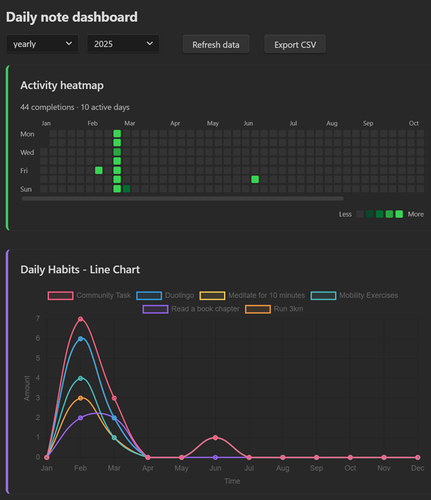

# Plugin Dashboard de Notas Diarias

El Plugin Dashboard de Notas Diarias agrega y visualiza los datos de tus notas diarias, permitiéndote hacer seguimiento de casillas de verificación y etiquetas a lo largo del tiempo. Lee las completaciones de casillas de secciones específicas en tus Notas Diarias y organiza los datos de etiquetas (por ejemplo, `#work/documentation` o `#project/planning`) en gráficos interactivos.

## Características

- **Vista del Panel (Dashboard):** Panel interactivo para visualizar las completaciones de casillas y el uso de etiquetas.
- **Selección de Período:** Filtra por períodos semanales, mensuales o anuales; los períodos se autocompletan desde tus notas.
- **Gráficos Dinámicos:** Los gráficos se actualizan desde tus Notas Diarias; se admite actualización manual.
- **Botón de Actualización:** Actualización de datos con un clic en el panel.
- **Exportación CSV:** Exporta los datos de casillas, etiquetas y actividad diaria del período seleccionado a un archivo CSV en tu bóveda.
- **Control de Carpetas:** Escanea solo las carpetas seleccionadas o toda tu bóveda.
- **Seguimiento Flexible de Casillas:**
  - **Seguimiento Basado en Secciones:** Rastrea las casillas completadas solo bajo los encabezados especificados.
  - **Agrupación de Tareas:** Normaliza entradas que terminan con "Tarea N" (por ejemplo, "Proyecto Tarea 3" → "Proyecto Tarea").
  - **Coincidencia Flexible de Encabezados:** Coincide con encabezados en niveles exactos o en cualquier nivel (ver Configuración).
- **Seguimiento Integral de Etiquetas:**
  - **Etiquetas Combinadas (Combo):** Analiza etiquetas `#grupo/elemento` y resume por grupo y por elemento.
  - **Etiquetas Simples:** Analiza `#etiqueta` sin barra diagonal.
  - **Etiquetas con Emoji:** Analiza etiquetas basadas en emojis (por ejemplo, `#🚀`).
  - **Filtrado de Falsos Positivos:** Omite fragmentos de URL, bloques de código y caracteres numeral que no son etiquetas.
- **Gráficos Configurables:** Alterna la visibilidad por tipo de gráfico y controla el orden de visualización. Incluye gráficos de barras apiladas, gráficos de líneas y un mapa de calor de actividad estilo GitHub para visualizar tendencias a lo largo del tiempo.
- **Mapa de Calor de Actividad:** Muestra las completaciones diarias de casillas como una cuadrícula de intensidad de color para la semana, mes o año seleccionado (habilitado por defecto; aparece primero a menos que cambies su orden).
- **Cinta y Comando:** Abre el panel mediante un icono en la cinta o desde la paleta de comandos.

## Instalación

1. Busca los complementos de Obsidian para Daily Note Metrics.
2. Habilita el complemento desde la Configuración de Obsidian en la sección "Complementos de la Comunidad".
3. Abre la vista del Panel a través de la paleta de comandos o haciendo clic en el icono designado en la cinta.

## Uso

- **Panel (Dashboard):** Una vez activado, el panel muestra tus datos agregados.
- **Menús Desplegables de Período:** Usa los menús desplegables para seleccionar el tipo de período (semanal, mensual, anual) y el período específico que deseas ver.
- **Actualizar Datos:** Haz clic en el botón **Refresh data** para actualizar los gráficos con los datos más recientes de tus Notas Diarias.
- **Exportar CSV:** Haz clic en el botón **Export CSV** para guardar los datos del período seleccionado actualmente en tu bóveda (ver [Exportación CSV](#csv-export)).

### Abrir el Panel

- Cinta: Haz clic en el icono de gráfico de barras etiquetado como "Daily note dashboard" en la cinta lateral.
- Paleta de Comandos: Ejecuta el comando **Open dashboard**.

## Supuestos de Análisis de Nombre de Archivo y Fecha

El complemento utiliza una función auxiliar para analizar una fecha desde el nombre del archivo de una nota diaria. **Asume que el nombre del archivo comienza con una fecha en el formato "YYYY-MM-DD".**  
Por ejemplo, un archivo llamado `2023-04-25 - Daily Note.md` tendrá su fecha analizada como 25 de abril de 2023.

Las fechas se interpretan usando tu **día del calendario local** (no UTC), por lo que el agrupamiento por semanas y meses se mantiene alineado con la fecha en el nombre del archivo.

Si un nombre de archivo no comienza con una fecha en el formato esperado, el complemento recurrirá al tiempo de creación del archivo (tal como se registra en `file.stat.ctime`). Este respaldo garantiza que siempre haya una fecha disponible para la agregación, aunque puede que no siempre refleje la fecha intencional de la nota. Para un análisis de datos preciso, asegúrate de que los nombres de tus notas diarias sigan la convención de nomenclatura "YYYY-MM-DD".

## Cómo Funcionan los Períodos y la Agregación

- **Semanal:** Las semanas comienzan el lunes. Los subperíodos son los días de la semana (Lun–Dom). Las barras apiladas muestran los recuentos por día con totales en los consejos de herramientas (tooltips).
- **Mensual:** Agrupa por mes del calendario (`YYYY-MM`). Los subperíodos son intervalos semanales dentro del mes: `Semana 1`–`Semana 5`.
- **Anual:** Agrupa por año (`YYYY`). Los subperíodos son meses (`Ene`–`Dic`).

## Mapa de Calor de Actividad

El mapa de calor de actividad visualiza cuántas casillas de verificación rastreadas completaste cada día en el período seleccionado. La intensidad escala de menos a más en relación con el día más ocupado de ese período.

- **Semanal:** Una celda por día (Lun–Dom).
- **Mensual:** Cuadrícula de calendario para el mes seleccionado.
- **Anual:** Columnas de semanas estilo GitHub para el año completo, con etiquetas de mes.

Cada celda muestra un consejo de herramientas (tooltip) con la fecha y el recuento de completaciones. Un breve resumen sobre la cuadrícula enumera las completaciones totales y los días activos. Alterna la visibilidad y el orden de visualización bajo **Visibilidad de Gráficos** / **Orden de Visualización de Gráficos** (por defecto, el orden es `0`, por lo que aparece primero).

## Exportación CSV

Usa **Export CSV** en el panel para escribir los datos agregados del período seleccionado actualmente en tu bóveda.

- **Ubicación:** Los archivos se guardan bajo `Note Metrics Exports/` en la raíz de la bóveda.
- **Nombre de archivo:** `note-metrics-{periodType}-{periodKey}.csv` (por ejemplo, `note-metrics-monthly-2026-03.csv`). Reexportar el mismo período sobrescribe el archivo existente.
- **Contenido:** Una fila por punto de datos, que incluye casillas (por encabezado y hábito), etiquetas combinadas, etiquetas de grupo, etiquetas simples, etiquetas con emoji y recuentos de actividad diaria utilizados por el mapa de calor. Columnas: `period_type`, `period`, `data_type`, `heading`, `group`, `item`, `sub_period`, `date`, `count` (las columnas no utilizadas se dejan en blanco para un tipo de fila dado).

## Seguimiento de Casillas

El complemento analiza las casillas bajo los encabezados especificados en tu configuración. Por defecto, busca casillas bajo el encabezamiento **`## Daily Habits`**, pero puedes personalizar esto en la configuración del complemento. El complemento leerá todas las casillas bajo un encabezado hasta que encuentre el siguiente.

### Coincidencia Flexible de Encabezados (Nuevo)

- **Coincidencia a Cualquier Nivel:**
  - Si ingresas un encabezado en la configuración **sin un `#`** (por ejemplo, `Daily Habits`), el complemento coincidirá con ese encabezado en **cualquier nivel de encabezado** (por ejemplo, `# Daily Habits`, `## Daily Habits`, `### Daily Habits`, etc.).
- **Coincidencia Específica de Nivel:**
  - Si ingresas un encabezado **con un `#`** (por ejemplo, `## Daily Habits`), el complemento solo coincidirá con ese nivel de encabezado exacto (a menos que habilites la opción de alternancia a continuación).
- **Opción de Alternancia Ignorar Niveles de Encabezado:**
  - Si habilitas la opción de alternancia **Ignore heading levels** en la configuración, todos los encabezados que comiencen con `#` también coincidirán en cualquier nivel de encabezado (igual que aquellos sin `#`).

#### Ejemplo

Configuración:
- `Daily Habits`
- `## Work Tasks`

Markdown:
~~~markdown
# Daily Habits
- [ ] Run 3km

## Daily Habits
- [ ] Meditate

### Work Tasks
- [ ] Review pull requests

## Work Tasks
- [ ] Update documentation
~~~

- Con la configuración anterior, se rastrearán todas las casillas bajo cualquier encabezado llamado "Daily Habits" (sin importar el nivel), y solo se rastrearán las casillas bajo `## Work Tasks` (a menos que se habilite la opción de alternancia, en cuyo caso se rastrearán todos los niveles de "Work Tasks").

*Nota:* Solo se cuentan las casillas completadas (`- [x] ...`) bajo los encabezados rastreados. El complemento lee todas las casillas bajo un encabezado hasta encontrar otro.

## Seguimiento de Etiquetas

El complemento captura y organiza automáticamente las etiquetas de tus notas diarias. Puedes usar tanto etiquetas simples como etiquetas jerárquicas (etiquetas combinadas) para categorizar tus notas.

### Tipos de Etiquetas

1. **Etiquetas Simples:** Etiquetas simples que comienzan con `#` y no contienen una barra diagonal (por ejemplo, `#important`, `#urgent`, `#meeting`)
2. **Etiquetas Combinadas (Combo):** Etiquetas jerárquicas que usan una barra diagonal (por ejemplo, `#work/documentation`, `#project/planning`)

### Ejemplo de Uso

~~~markdown
#important #urgent #meeting #work/documentation #project/planning
~~~

El complemento hará lo siguiente:
- Rastrear las etiquetas simples por separado (por ejemplo, `#important`, `#urgent`, `#meeting`)
- Agrupar las etiquetas combinadas por su prefijo (por ejemplo, todas las etiquetas `#work/...` se agrupan juntas)
- Mostrar el uso de etiquetas en gráficos interactivos con gráficos separados para etiquetas simples y etiquetas combinadas
- Mostrar tendencias a lo largo del tiempo tanto para etiquetas individuales como para grupos de etiquetas

### Filtrado de Etiquetas para Evitar Falsos Positivos

El analizador evita contar caracteres numeral que forman parte de URLs, bloques de código, código en línea o fragmentos similares a sistemas (por ejemplo, `slide=id.x`, `heading=h.x`, o hashes largos). Esto reduce el ruido proveniente de enlaces pegados o fragmentos de código.

## Configuración de Visibilidad de Gráficos

El complemento te permite personalizar qué gráficos se muestran en el panel. Puedes habilitar o deshabilitar tipos específicos de gráficos según tus preferencias y necesidades.

### Tipos de Gráficos Disponibles

**Gráficos de Barras:**
1. **Gráficos de Casillas:** Muestra gráficos de barras apiladas para hábitos y tareas bajo encabezados rastreados
2. **Gráficos de Etiquetas:** Muestra gráficos de barras apiladas para etiquetas combinadas (por ejemplo, #work/urgent)
3. **Gráfico de Etiquetas de Grupo:** Muestra un gráfico de barras apiladas para recuentos de etiquetas de grupo (por ejemplo, #work, #personal)
4. **Gráfico de Etiquetas Simples:** Muestra un gráfico de barras apiladas para etiquetas simples sin categorías (por ejemplo, #important, #urgent)
5. **Gráfico de Etiquetas con Emoji:** Muestra un gráfico de barras apiladas para el uso de etiquetas con emoji (por ejemplo, 🚀, 📚)

**Gráficos de Líneas:**
6. **Gráficos de Líneas de Casillas:** Muestra gráficos de líneas para hábitos de casillas con el tiempo en el eje x y la cantidad en el eje y
7. **Gráficos de Líneas de Etiquetas Combinadas:** Muestra gráficos de líneas para etiquetas combinadas con el tiempo en el eje x y la cantidad en el eje y
8. **Gráfico de Líneas de Etiquetas de Grupo:** Muestra un gráfico de líneas para el resumen de etiquetas de grupo con el tiempo en el eje x y la cantidad en el eje y
9. **Gráfico de Líneas de Etiquetas con Emoji:** Muestra un gráfico de líneas para etiquetas con emoji con el tiempo en el eje x y la cantidad en el eje y
10. **Gráfico de Líneas de Etiquetas Simples:** Muestra un gráfico de líneas para etiquetas simples con el tiempo en el eje x y la cantidad en el eje y

**Mapa de Calor:**
11. **Mapa de Calor de Actividad:** Mapa de calor de calendario estilo GitHub de completaciones diarias de casillas para el período seleccionado (mostrado por defecto)

### Cómo Configurar

1. Ve a **Configuración** → **Complementos de la Comunidad** → **Daily Note Dashboard**
2. Desplázate hacia abajo hasta la sección **Visibilidad de Gráficos**
3. Usa los interruptores de alternancia para habilitar/deshabilitar los gráficos que deseas ver
4. Los cambios entran en efecto inmediatamente cuando actualizas el panel

Esta función es particularmente útil si deseas:
- Centrarte en tipos específicos de datos (por ejemplo, solo hábitos y tareas)
- Ocultar gráficos que no son relevantes para tu bóveda actual
- Reducir el desorden visual en el panel
- Personalizar el panel para diferentes casos de uso o proyectos

## Orden de Visualización de Gráficos

Controla el orden en que aparecen las secciones de gráficos. Los números más bajos se renderizan primero.

**Gráficos de Barras:**
- **Orden de Gráficos de Casillas**: Posición de los gráficos de barras de casillas.
- **Orden de Gráficos de Etiquetas Combinadas**: Posición de los gráficos de barras de etiquetas combinadas por grupo.
- **Orden de Resumen de Etiquetas de Grupo**: Posición del gráfico de barras general de etiquetas de grupo.
- **Orden de Gráfico de Etiquetas con Emoji**: Posición del gráfico de barras de etiquetas con emoji.
- **Orden de Gráfico de Etiquetas Simples**: Posición del gráfico de barras de etiquetas simples.

**Gráficos de Líneas:**
- **Orden de Gráficos de Líneas de Casillas**: Posición de los gráficos de líneas de casillas.
- **Orden de Gráficos de Líneas de Etiquetas Combinadas**: Posición de los gráficos de líneas de etiquetas combinadas.
- **Orden de Gráfico de Líneas de Etiquetas de Grupo**: Posición del gráfico de líneas de etiquetas de grupo.
- **Orden de Gráfico de Líneas de Etiquetas con Emoji**: Posición del gráfico de líneas de etiquetas con emoji.
- **Orden de Gráfico de Líneas de Etiquetas Simples**: Posición del gráfico de líneas de etiquetas simples.

**Mapa de Calor:**
- **Orden de Mapa de Calor de Actividad**: Posición del mapa de calor de actividad (por defecto es `0`, por lo que aparece primero).

Ajusta esto en Configuración → Orden de Visualización de Gráficos.

## Configuración

Abre Configuración de Obsidian → Complementos de la Comunidad → Daily Note Dashboard.

- **Carpetas para escanear**
  - Mantén una lista de carpetas para incluir al escanear las Notas Diarias.
  - Añade/elimina carpetas con los controles de la interfaz.
  - Alterna **Escanear todas las carpetas** para procesar toda la bóveda.
- **Encabezados para rastrear**
  - Proporciona uno o más encabezados que contengan las casillas a contar.
  - Ingresa con o sin símbolos `#`:
    - Sin `#`: coincide en cualquier nivel de encabezado.
    - Con `#`: coincide con el nivel exacto a menos que habilites la opción de alternancia a continuación.
  - Usa la opción de alternancia **Ignore heading levels** para coincidir con encabezados sin importar el nivel.
- **Visibilidad de Gráficos**
  - Alterna qué tipos de gráficos aparecen en el panel: Casillas, Etiquetas Combinadas, Etiquetas de Grupo, Etiquetas con Emoji, Etiquetas Simples, sus variantes correspondientes de gráficos de líneas y el Mapa de Calor de Actividad.
- **Orden de Visualización de Gráficos**
  - Establece el orden numérico para cada tipo de gráfico (gráficos de barras, gráficos de líneas y mapa de calor) para controlar el diseño.

## Personalización

Puedes modificar fácilmente los estilos CSS para elementos como el botón de actualización editando el archivo CSS del complemento o añadiendo estilos personalizados a tu tema de Obsidian.

## Contribuir

¡Las contribuciones son bienvenidas! No dudes en enviar solicitudes de extracción (pull requests) o reportar problemas en el repositorio de GitHub del complemento.

## Licencia

Este complemento se publica bajo la Licencia MIT.

Este complemento utiliza [Chart.js](https://www.chartjs.org/) (licenciado bajo la Licencia MIT) para renderizar gráficos interactivos.
