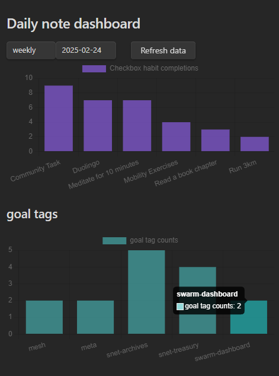

# Daily Note Dashboard Plugin

The Daily Note Dashboard Plugin aggregates and visualizes your daily note data, allowing you to track checkboxes and tags over time. It reads checkbox completions from specified sections in your Daily Notes and organizes tag data (e.g., `#work/documentation` or `#project/planning`) into interactive charts.

## Features

- **Dashboard View:** Interactive dashboard that displays charts representing your checkbox completions and tag usage.
- **Period Selection:** Filter your data by weekly, monthly, or yearly periods.
- **Dynamic Charts:** Automatically update charts based on your Daily Note entries.
- **Refresh Button:** Manually refresh the dashboard data with a single click.
- **Flexible Checkbox Tracking:**
  - **Section-based Tracking:** Track checkboxes under any specified heading in your notes. The plugin groups similar tasks by normalizing entries that end with "Task" followed by a number (e.g., "Project Task 3" is grouped with all "Project Task" entries).
- **Comprehensive Tag Tracking:**
  - **Single and Combo Tags:** Captures both single tags (e.g., `#work`) and combo tags (e.g., `#work/documentation`).
  - **Group Tags Chart:** Aggregates both plain and combo tags into a group chart for a comprehensive overview.

## Installation

1. Browse Obsidian plugins for Daily Note Metrics.
2. Enable the plugin from Obsidian's Settings under the "Community Plugins" section.
3. Open the Dashboard view via the command palette or by clicking the designated icon in the ribbon.

## Usage

- **Dashboard:** Once activated, the dashboard displays your aggregated data.
- **Period Dropdowns:** Use the dropdown menus to select the period type (weekly, monthly, yearly) and the specific period you want to view.
- **Refresh Data:** Click the **Refresh data** button to update the charts with the latest data from your Daily Notes.

## Filename and Date Parsing Assumptions

The plugin uses a helper function to parse a date from a daily note's filename. **It assumes that the filename begins with a date in the "YYYY-MM-DD" format.**  
For example, a file named `2023-04-25 - Daily Note.md` will have its date parsed as April 25, 2023.

If a filename does not start with a date in the expected format, the plugin will fall back to using the file's creation time (as recorded in `file.stat.ctime`). This fallback ensures that a date is always available for aggregation, though it may not always reflect the intended note date. For accurate data parsing, please ensure your daily note filenames follow the "YYYY-MM-DD" naming convention.

## Checkbox Tracking

The plugin parses checkboxes under specified headings in your settings. By default, it looks for checkboxes under the **`## Daily Habits`** heading, but you can customize this in the plugin settings. The plugin will read all checkboxes under a heading until it encounters the next heading of the same or higher level.

### Flexible Heading Matching (New)

- **Any Level Matching:**
  - If you enter a heading in the settings **without a `#`** (e.g., `Daily Habits`), the plugin will match that heading at **any heading level** (e.g., `# Daily Habits`, `## Daily Habits`, `### Daily Habits`, etc.).
- **Level-Specific Matching:**
  - If you enter a heading **with a `#`** (e.g., `## Daily Habits`), the plugin will only match that exact heading level (unless you enable the toggle below).
- **Ignore Heading Levels Toggle:**
  - If you enable the **Ignore heading levels** toggle in the settings, all headings that start with `#` will also match at any heading level (just like those without a `#`).

#### Example

Settings:
- `Daily Habits`
- `## Work Tasks`

Markdown:
~~~markdown
# Daily Habits
- [ ] Run 3km

## Daily Habits
- [ ] Meditate

### Work Tasks
- [ ] Review pull requests

## Work Tasks
- [ ] Update documentation
~~~

- With the above settings, all checkboxes under any heading named "Daily Habits" (regardless of level) will be tracked, and only checkboxes under `## Work Tasks` will be tracked (unless the toggle is enabled, in which case all levels of "Work Tasks" will be tracked).

*Note:* Checkboxes will only be recognized if they are under one of the headings specified in your plugin settings and follow the proper markdown checkbox syntax. The plugin reads all checkboxes under a heading until it finds another heading of the same or higher level.

## Tag Tracking

The plugin automatically captures and organizes tags from your daily notes. You can use both single tags and hierarchical tags (combo tags) to categorize your notes.

### Tag Types

1. **Single Tags:** Simple tags that start with `#` (e.g., `#work`, `#meeting`)
2. **Combo Tags:** Hierarchical tags that use a forward slash (e.g., `#work/documentation`, `#project/planning`)

### Example Usage

~~~markdown
#work #meeting #project/planning #work/documentation
~~~

The plugin will:
- Track the frequency of each tag
- Group combo tags by their prefix (e.g., all `#work/...` tags are grouped together)
- Display tag usage in interactive charts
- Show trends over time for both individual tags and tag groups

## Customization

You can easily modify the CSS styles for elements like the refresh button by editing the plugin's CSS file or adding custom styles to your Obsidian theme.

## Contributing

Contributions are welcome! Feel free to submit pull requests or report issues on the plugin's GitHub repository.

## License

This plugin is released under the MIT License.

This plugin uses [Chart.js](https://www.chartjs.org/) (licensed under the MIT License) for rendering interactive charts.
