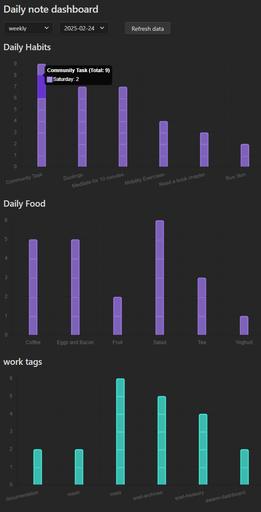

# Daily Note Dashboard Plugin

The Daily Note Dashboard Plugin aggregates and visualizes your daily note data, allowing you to track checkboxes and tags over time. It reads checkbox completions from specified sections in your Daily Notes and organizes tag data (e.g., `#work/documentation` or `#project/planning`) into interactive charts.

## Features

- **Dashboard View:** Interactive dashboard to visualize checkbox completions and tag usage.
- **Period Selection:** Filter by weekly, monthly, or yearly periods; periods auto-populate from your notes.
- **Dynamic Charts:** Charts update from your Daily Notes; manual refresh supported.
- **Refresh Button:** One-click data refresh in the dashboard.
- **Folders Control:** Scan only selected folders or your entire vault.
- **Flexible Checkbox Tracking:**
  - **Section-based Tracking:** Track completed checkboxes under specified headings only.
  - **Task Grouping:** Normalizes entries ending with "Task N" (e.g., "Project Task 3" → "Project Task").
  - **Flexible Heading Matching:** Match headings at exact levels or at any level (see Settings).
- **Comprehensive Tag Tracking:**
  - **Combo Tags:** Parses `#group/item` tags and summarizes per group and per item.
  - **Single Tags:** Parses `#tag` without a slash.
  - **Emoji Tags:** Parses emoji-based tags (e.g., `#🚀`).
  - **False-Positive Filtering:** Skips URL fragments, code blocks, and hashes that are not tags.
- **Configurable Charts:** Toggle visibility per chart type and control chart display order.
- **Ribbon & Command:** Open the dashboard via a ribbon icon or command palette.

## Installation

1. Browse Obsidian plugins for Daily Note Metrics.
2. Enable the plugin from Obsidian's Settings under the "Community Plugins" section.
3. Open the Dashboard view via the command palette or by clicking the designated icon in the ribbon.

## Usage

- **Dashboard:** Once activated, the dashboard displays your aggregated data.
- **Period Dropdowns:** Use the dropdown menus to select the period type (weekly, monthly, yearly) and the specific period you want to view.
- **Refresh Data:** Click the **Refresh data** button to update the charts with the latest data from your Daily Notes.

### Open the Dashboard

- Ribbon: Click the bar-chart icon labeled "Daily note dashboard" in the side ribbon.
- Command Palette: Run the command **Open dashboard**.

## Filename and Date Parsing Assumptions

The plugin uses a helper function to parse a date from a daily note's filename. **It assumes that the filename begins with a date in the "YYYY-MM-DD" format.**  
For example, a file named `2023-04-25 - Daily Note.md` will have its date parsed as April 25, 2023.

If a filename does not start with a date in the expected format, the plugin will fall back to using the file's creation time (as recorded in `file.stat.ctime`). This fallback ensures that a date is always available for aggregation, though it may not always reflect the intended note date. For accurate data parsing, please ensure your daily note filenames follow the "YYYY-MM-DD" naming convention.

## How Periods and Aggregation Work

- **Weekly:** Weeks start on Monday. Sub-periods are days of the week (Mon–Sun). Stacked bars show counts per day with totals in tooltips.
- **Monthly:** Groups by calendar month (`YYYY-MM`). Sub-periods are week buckets within the month: `Week 1`–`Week 5`.
- **Yearly:** Groups by year (`YYYY`). Sub-periods are months (`Jan`–`Dec`).

## Checkbox Tracking

The plugin parses checkboxes under specified headings in your settings. By default, it looks for checkboxes under the **`## Daily Habits`** heading, but you can customize this in the plugin settings. The plugin will read all checkboxes under a heading until it encounters the next heading.

### Flexible Heading Matching (New)

- **Any Level Matching:**
  - If you enter a heading in the settings **without a `#`** (e.g., `Daily Habits`), the plugin will match that heading at **any heading level** (e.g., `# Daily Habits`, `## Daily Habits`, `### Daily Habits`, etc.).
- **Level-Specific Matching:**
  - If you enter a heading **with a `#`** (e.g., `## Daily Habits`), the plugin will only match that exact heading level (unless you enable the toggle below).
- **Ignore Heading Levels Toggle:**
  - If you enable the **Ignore heading levels** toggle in the settings, all headings that start with `#` will also match at any heading level (just like those without a `#`).

#### Example

Settings:
- `Daily Habits`
- `## Work Tasks`

Markdown:
~~~markdown
# Daily Habits
- [ ] Run 3km

## Daily Habits
- [ ] Meditate

### Work Tasks
- [ ] Review pull requests

## Work Tasks
- [ ] Update documentation
~~~

- With the above settings, all checkboxes under any heading named "Daily Habits" (regardless of level) will be tracked, and only checkboxes under `## Work Tasks` will be tracked (unless the toggle is enabled, in which case all levels of "Work Tasks" will be tracked).

*Note:* Only completed checkboxes (`- [x] ...`) under tracked headings are counted. The plugin reads all checkboxes under a heading until it finds another heading.

## Tag Tracking

The plugin automatically captures and organizes tags from your daily notes. You can use both single tags and hierarchical tags (combo tags) to categorize your notes.

### Tag Types

1. **Single Tags:** Simple tags that start with `#` and don't contain a forward slash (e.g., `#important`, `#urgent`, `#meeting`)
2. **Combo Tags:** Hierarchical tags that use a forward slash (e.g., `#work/documentation`, `#project/planning`)

### Example Usage

~~~markdown
#important #urgent #meeting #work/documentation #project/planning
~~~

The plugin will:
- Track single tags separately (e.g., `#important`, `#urgent`, `#meeting`)
- Group combo tags by their prefix (e.g., all `#work/...` tags are grouped together)
- Display tag usage in interactive charts with separate charts for single tags and combo tags
- Show trends over time for both individual tags and tag groups

### Tag Filtering to Avoid False Positives

The parser avoids counting hashes that are part of URLs, code blocks, inline code, or system-like fragments (e.g., `slide=id.x`, `heading=h.x`, or long hashes). This reduces noise from pasted links or code snippets.

## Chart Visibility Settings

The plugin allows you to customize which charts are displayed in the dashboard. You can enable or disable specific chart types based on your preferences and needs.

### Available Chart Types

1. **Checkbox Charts:** Display charts for habits and tasks under tracked headings
2. **Tag Charts:** Show charts for combo tags (e.g., #work/urgent)
3. **Group Tags Chart:** Display chart for group tag counts (e.g., #work, #personal)
4. **Single Tags Chart:** Show chart for single tags without categories (e.g., #important, #urgent)
5. **Emoji Tags Chart:** Show chart for emoji tag usage (e.g., 🚀, 📚)

### How to Configure

1. Go to **Settings** → **Community Plugins** → **Daily Note Dashboard**
2. Scroll down to the **Chart Visibility** section
3. Use the toggle switches to enable/disable the charts you want to see
4. Changes take effect immediately when you refresh the dashboard

This feature is particularly useful if you want to:
- Focus on specific types of data (e.g., only habits and tasks)
- Hide charts that aren't relevant to your current vault
- Reduce visual clutter in the dashboard
- Customize the dashboard for different use cases or projects

## Chart Display Order

Control the order in which chart sections appear. Lower numbers render first.

- **Checkbox Charts Order**: Position of checkbox charts.
- **Combo Tag Charts Order**: Position of combo tag charts per group.
- **Group Tags Summary Order**: Position of the overall group tags chart.
- **Emoji Tags Chart Order**: Position of the emoji tags chart.
- **Single Tags Chart Order**: Position of the single tags chart.

Adjust these under Settings → Chart Display Order.

## Settings

Open Obsidian Settings → Community Plugins → Daily Note Dashboard.

- **Folders to scan**
  - Maintain a list of folders to include when scanning Daily Notes.
  - Add/remove folders with the UI controls.
  - Toggle **Scan all folders** to process the entire vault.
- **Headings to track**
  - Provide one or more headings that contain the checkboxes to count.
  - Enter with or without `#` symbols:
    - Without `#`: matches at any heading level.
    - With `#`: matches the exact level unless you enable the toggle below.
  - Use the **Ignore heading levels** toggle to match headings regardless of level.
- **Chart Visibility**
  - Toggle which chart types appear on the dashboard: Checkbox, Combo Tag, Group Tags, Emoji Tags, Single Tags.
- **Chart Display Order**
  - Set numeric order for each chart type to control layout.

## Customization

You can easily modify the CSS styles for elements like the refresh button by editing the plugin's CSS file or adding custom styles to your Obsidian theme.

## Contributing

Contributions are welcome! Feel free to submit pull requests or report issues on the plugin's GitHub repository.

## License

This plugin is released under the MIT License.

This plugin uses [Chart.js](https://www.chartjs.org/) (licensed under the MIT License) for rendering interactive charts.
